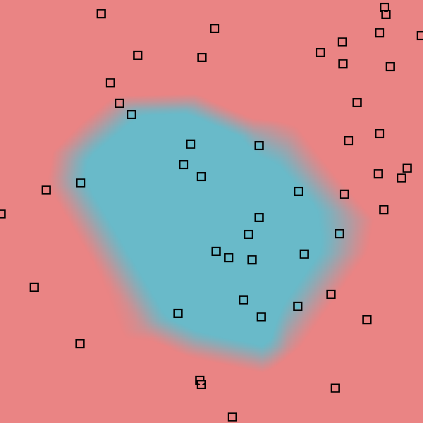
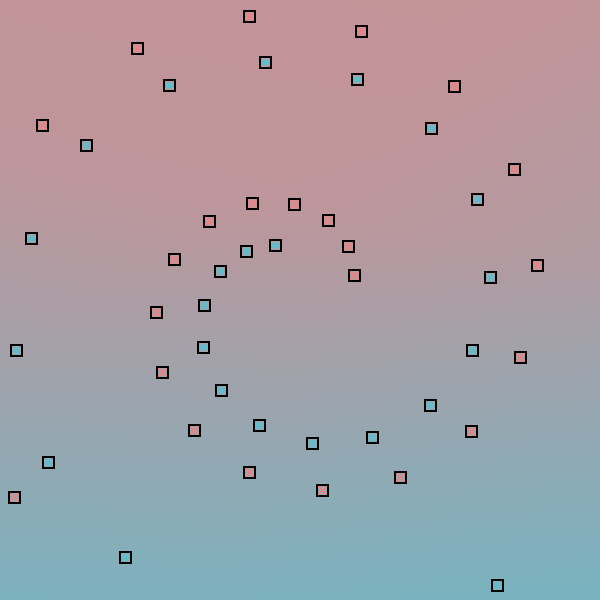

# MiniTorch Module 2


* Docs: https://minitorch.github.io/

* Overview: https://minitorch.github.io/module2/module2/

This assignment requires the following files from the previous assignments. You can get these by running

```bash
python sync_previous_module.py previous-module-dir current-module-dir
```

The files that will be synced are:

        minitorch/operators.py minitorch/module.py minitorch/autodiff.py minitorch/scalar.py minitorch/scalar_functions.py minitorch/module.py project/run_manual.py project/run_scalar.py project/datasets.py

## Task 2.5

Trained `project/run_tensor.py` with `random.seed(0)` before each run. Optimizer is the starter SGD; `max_epochs=500`. Time per epoch uses the Streamlit trainer formula `elapsed / (epoch + 1)`.

### Simple

- PTS=50, HIDDEN=2, RATE=0.5
- Epoch 100 loss 11.39 correct 49 time_per_epoch 0.0190s
- Epoch 500 loss 2.46 correct 49 time_per_epoch 0.0194s


### Diag

- PTS=50, HIDDEN=2, RATE=0.5
- Epoch 100 loss 11.31 correct 47 time_per_epoch 0.0194s
- Epoch 500 loss 1.08 correct 50 time_per_epoch 0.0197s


### Split

- PTS=50, HIDDEN=10, RATE=0.5
- Epoch 100 loss 14.86 correct 43 time_per_epoch 0.1463s
- Epoch 500 loss 2.50 correct 49 time_per_epoch 0.1497s


### Xor

- PTS=50, HIDDEN=10, RATE=0.5
- Epoch 100 loss 12.49 correct 46 time_per_epoch 0.1471s
- Epoch 500 loss 4.66 correct 48 time_per_epoch 0.1496s


### Circle

- PTS=50, HIDDEN=10, RATE=0.5
- Epoch 100 loss 22.22 correct 41 time_per_epoch 0.1486s
- Epoch 500 loss 4.52 correct 49 time_per_epoch 0.1502s



### Spiral

- PTS=50, HIDDEN=10, RATE=0.5
- Epoch 100 loss 34.65 correct 25 time_per_epoch 0.1484s
- Epoch 500 loss 33.63 correct 29 time_per_epoch 0.1499s

