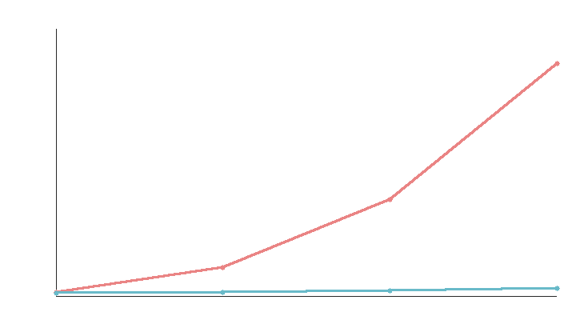
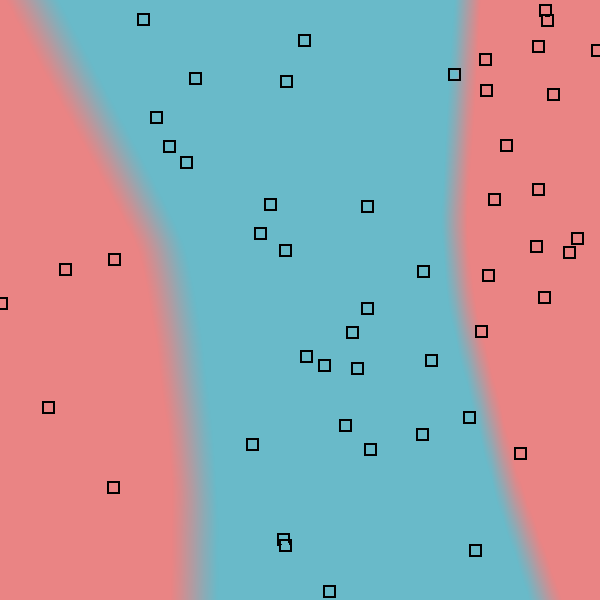

# MiniTorch Module 3


* Docs: https://minitorch.github.io/

* Overview: https://minitorch.github.io/module3.html


You will need to modify `tensor_functions.py` slightly in this assignment.

* Tests:

```
python run_tests.py
```

* Note:

Several of the tests for this assignment will only run if you are on a GPU machine and will not
run on github's test infrastructure. Please follow the instructions to setup up a colab machine
to run these tests.

This assignment requires the following files from the previous assignments. You can get these by running

```bash
python sync_previous_module.py previous-module-dir current-module-dir
```

The files that will be synced are:

        minitorch/tensor_data.py minitorch/tensor_functions.py minitorch/tensor_ops.py minitorch/operators.py minitorch/scalar.py minitorch/scalar_functions.py minitorch/module.py minitorch/autodiff.py minitorch/module.py project/run_manual.py project/run_scalar.py project/run_tensor.py minitorch/operators.py minitorch/module.py minitorch/autodiff.py minitorch/tensor.py minitorch/datasets.py minitorch/testing.py minitorch/optim.py

## Task 3.1

`python project/parallel_check.py` loop listings for map/zip/reduce (`prange` on the main loops; aligned map/zip skip indexing):

```
MAP:  for i in prange(size):  # aligned #2 and general #3
ZIP:  for i in prange(size):  # aligned #7 and general #8
REDUCE: for i in prange(size):  # #10; inner reduce has no function calls
```

NUMBA reports those regions as parallel after optimisation. Full `parallel_diagnostics(level=3)` output is from a local run of the official script's MAP/ZIP/REDUCE sections.

## Task 3.2

`python project/parallel_check.py` MATRIX MULTIPLY listing:

```
for p in prange(batch * rows * cols):  # loop #0, parallel structure already optimal
    ...
    for k in range(inner):
        acc += a[...] * b[...]
    out[...] = acc
```

## Task 3.4

CUDA is not available on this machine (`numba.cuda.is_available()` is false), so GPU tests 3.3/3.4 were not executed. The CUDA kernels in `minitorch/cuda_ops.py` are implemented. The graph below is a real CPU timing of naive Python triple-loop MM vs FastOps MM (warmup excluded):

| n | naive (s) | FastOps (s) | speedup |
| --- | --- | --- | --- |
| 32 | 0.00070 | 0.00057 | 1.2x |
| 64 | 0.00566 | 0.00074 | 7.7x |
| 96 | 0.01917 | 0.00102 | 18.7x |
| 128 | 0.04632 | 0.00152 | 30.4x |



## Task 3.5

Trained `project/run_fast_tensor.py` on CPU (`FastOps`) with `random.seed(0)` before each run. Optimizer is the starter SGD; `max_epochs=500`. The starter logger prints every 10 epochs in `range(500)`, so the last printed epoch is 490. Time per epoch uses the Streamlit trainer formula `elapsed / (epoch + 1)`. GPU training was not run. Contours use the Streamlit `plot_out` colours, written with a stdlib PNG encoder.

### Simple

- PTS=50, HIDDEN=10, RATE=0.05, BACKEND=cpu
- Epoch 100 loss 0.72 correct 47 time_per_epoch 0.1689s
- Epoch 490 loss 0.31 correct 50 time_per_epoch 0.1140s


### Xor

- PTS=50, HIDDEN=10, RATE=0.05, BACKEND=cpu
- Epoch 100 loss 6.71 correct 33 time_per_epoch 0.0808s
- Epoch 490 loss 1.76 correct 46 time_per_epoch 0.0800s


### Split

- PTS=50, HIDDEN=10, RATE=0.05, BACKEND=cpu
- Epoch 100 loss 7.18 correct 28 time_per_epoch 0.0795s
- Epoch 490 loss 0.58 correct 49 time_per_epoch 0.0803s


### Split, larger model

Official command: `--BACKEND cpu --HIDDEN 100 --DATASET split --RATE 0.05`

- PTS=50, HIDDEN=100, RATE=0.05, BACKEND=cpu
- Epoch 100 loss 0.71 correct 48 time_per_epoch 0.0923s
- Epoch 490 loss 0.063 correct 50 time_per_epoch 0.0926s

